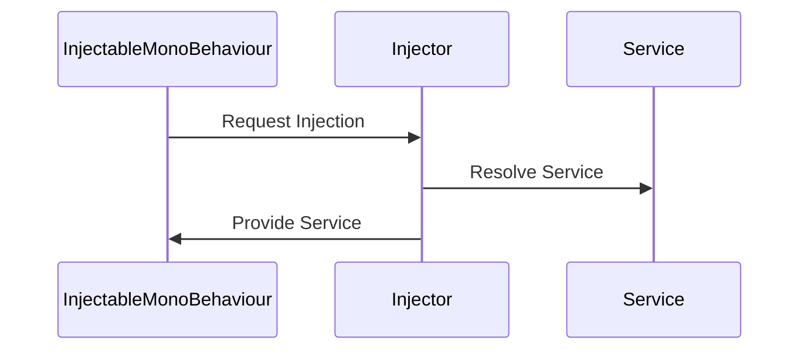

# SparkCore Framework


Welcome to **SparkCore**, a simple to use Unity3D framework mainly built for code reusability and testability in mind. SparkCore simplifies Unity development by automating dependency injection and decoupling event handling for a seamless development experience.

   
   

## Table of Contents
- [Installation](#installation)
- [Usage](#usage)
    - [Dependency Injection](#dependency-injection)
    - [Events](#events)
    - [Singletons](#singletons)
    - [Bootstrapper](#bootstrapper)
    - [Debugger](#debugger)
- [Editor Window](#editor-window)

## Installation
In Unity Package Manager (UPM) Add Package from git URL:<BR>
https://github.com/muammar-yacoob/SparkCore.git?path=Assets/Package

## Usage
### Dependency Injection
As Unity's MonoBehaviours do not expose constructors; Types deriving from `InjectableMonoBehaviour` can have their dependencies injected using the `[Inject]` annotation.

#### <li> POCO Service Injection </li>
For services to be injectable, they need to be decorated using the `[ServiceProvider]` you can explicitly register the service to be transient using the runtime type parameter as such `[ServiceProvider(ServiceLifetime.Transient)]` otherwise, it will default to [ServiceProvider(ServiceLifetime.Singleton)]

example:
```csharp
    public class InjectionTest : InjectableMonoBehaviour
    {
        [Inject] private ILogger logger;
        
        private void OnEnable()
        {
            logger.Log("Hello Injection!");
        }
    }

    [ServiceProvider]
    public class ConsoleLogger : ILogger
    {
        public void Log(string message) => Debug.Log($"ConsoleLogger: {message}");
    }
    
    [ServiceProvider]
    public class AnotherLogger : ILogger
    {
        public void Log(string message) => Debug.Log($"AnotherLogger: {message}");
    }
```

More examples:
```csharp
    public class InjectionTest : InjectableMonoBehaviour
    {
        //Injects the first registered service of type ILogger
        [Inject] private ILogger _logger ;
        [Inject] private ILogger logger { get; set; }


        //Registered as Singleton, will inject the same instance of ConsoleLogger
        [Inject(typeof(ConsoleLogger))] private ILogger logger;
        //Registered as Transient, will inject a new instance of AnotherLogger
        [Inject(typeof(AnotherLogger))] private ILogger logger;

        [Inject] private void SetupLogger(ILogger logger)
        {
            logger.Log($"Hello Method Injection!");
        }

        private void OnEnable()
        {
            _logger.Log($"Hello field Injection!");
            logger.Log($"Hello property Injection!");
        }
```
> **Important Note:**
When your project has multiple implementations of an `IService` per say, it's best to explicitly specify the concrete implementation type by providing the type in the `[Inject]` attribute, as demonstrated in the `InjectionTest` example above. Omitting the type parameter will result in the latest registered concrete implementation being resolved during injection. 
<br>
```csharp
[Inject(typeof(ConcreteService))] private IService service;
```


#### <li> MonoBehaviour injection </li>
When injecting MonoBehaviours, SparkCore follows these steps:

1. Searches for an existing instance of the MonoBehaviour in the scene.
2. If found, uses the existing instance.
3. If not found, adds the MonoBehaviour as a component to the requesting object.
4. Logs a warning to indicate that a MonoBehaviour was automatically added.

This approach allows for more flexible use of MonoBehaviours in your dependency injection setup, but it's recommended to manage MonoBehaviour lifecycles explicitly when possible.

<br>

#### Singleton vs Transient Services
Notice how services registered as singletons will maintain the same guid between different service users and scenes.


#### Injection Sequence Diagram


### Singletons
You can make any MonoBehaviour a singleton or a persistent singleton by inheriting from SingletonMonoBehaviour and PersistentSingleton respectively.

### Runtime Utilities
#### Bootstrapper
Loads the `RuntimeInjector` prefab into the scene. This is where the container is built using C# reflection to find and register all `[Inject]` decorated dependencies in all `InjectableMonoBehaviour` objects. The current implementation uses VContainer to build the container; nevertheless, completely decoupled to be easily replaced by any other third party injection framework if need be.

#### Debugger
An edit-time script that loads the first scene, clears the console and loads the bootstrapper instance. It is useful when running the Unity editor from other non-starting scenes that may be missing necessary and persistent gameObjects from the first scene.

## Events
The static `EventManager` class handles events publishing and subscriptions. It's an internal class to the framework and can be only accessed by `InjectableMonoBehaviour` objects.

### Usage
**1. Creating an event:** Extend the `MonoEvent` type and add any necessary fields or properties, preferably with public accessors setup.
example:
```csharp
public class CustomEvent : MonoEvent
    {
        public readonly string Message;

        public CustomEvent(string message)
        {
            Message = message;
        }
    }
```
**2. Publishing events:** 
- From a POCO:
```csharp
    var customEvent = new CustomEvent("Hello Events from POCO!")
    EventManager.Instance.PublishEvent();
```
- From an `InjectableMonoBehaviour`:
```csharp
    public class PublisherMono : InjectableMonoBehaviour
    {
        private void OnEnable()
        {
            var customEvent = new CustomEvent("Hello Events from Mono!");
            PublishEvent(customEvent);
        }
    }
```

**Subscribing to events:**
- From a POCO:
```csharp
    EventManager.Instance.SubscribeEvent<CustomEvent>(HandleCustomEvent);

    private void HandleCustomEvent(CustomEvent customEvent)
    {
        UnityEngine.Debug.Log($"[POCO] Received event: {customEvent.Message}");
    }
```
- From an `InjectableMonoBehaviour`:
```csharp
    public class SubscriberMono : InjectableMonoBehaviour
        {
            private void OnEnable() => SubscribeEvent<CustomEvent>(HandleCustomEvent);
            private void OnDisable() => UnsubscribeEvent<CustomEvent>(HandleCustomEvent);

            void HandleCustomEvent(CustomEvent customEvent)
            {
                Debug.Log($"[Mono] Received event: {customEvent.Message}");
            }
        }
```

#### Event Sequence Diagram
```mermaid
sequenceDiagram
    participant A as InjectableMonoBehaviour
    participant B as EventManager
    participant C as EventSubscriber
    
    A->>B: Subscribe to Event
    B->>C: Register Event Subscriber
    A->>B: Publish Event
    B->>C: Notify Event Subscriber
   ```
<br><br>

### Editor Window
The Injection/Events window can be accessed from the main menu strip in Unity. Also, classes derived from `InjectableMonoBehaviour` have a custom inspector panel.
<br>

